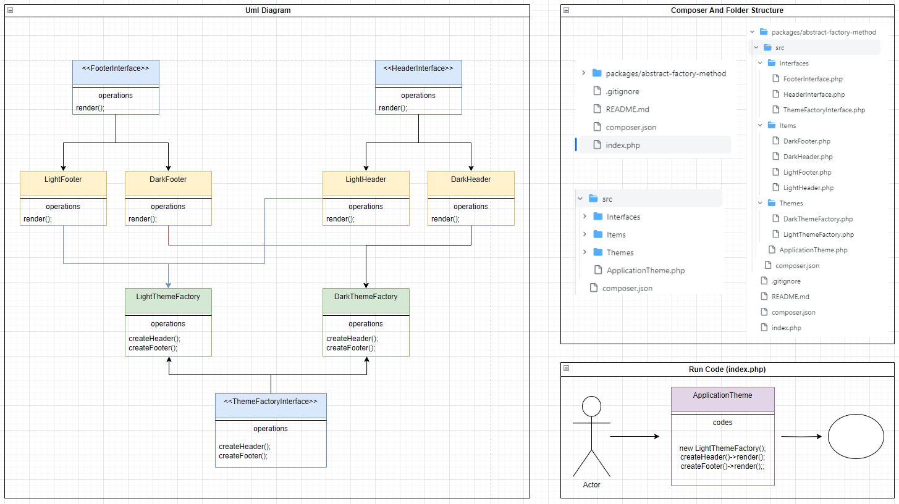

# Writing a php package using the abstract factory method

*Command;*
    
    composer install
    composer dump

*Example Usage (index.php);*
    
    $applicationTheme = new SelahattinGns\PhpPackageAbstractFactory\ApplicationTheme();
    
    $lightTheme = new \SelahattinGns\PhpPackageAbstractFactory\Themes\LightThemeFactory();
    $darkTheme = new \SelahattinGns\PhpPackageAbstractFactory\Themes\DarkThemeFactory();
    
    $applicationTheme->render($lightTheme);

---
**Structure;**

